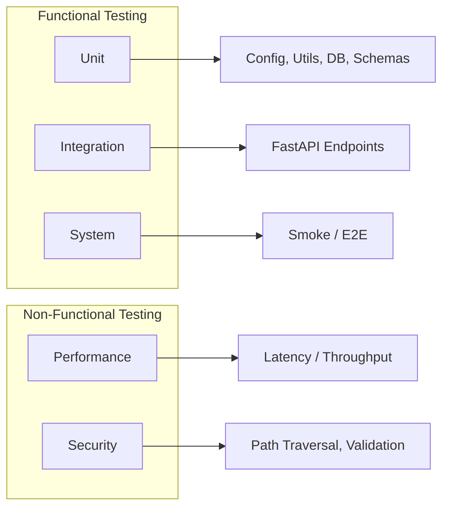

# Comprehensive Testing Plan for FYP Tennis Backend

## Current state

- **Framework:** FastAPI; all routes in [src/main.py](src/main.py).
- **No existing tests:** No `tests/` directory or pytest configuration in [pyproject.toml](pyproject.toml).
- **Key modules:** [src/core/utils.py](src/core/utils.py), [src/core/get_direction_change_indices.py](src/core/get_direction_change_indices.py), [src/db/utils.py](src/db/utils.py), [src/config.py](src/config.py), [src/celery/worker.py](src/celery/worker.py), and [src/main.py](src/main.py) (API).

---

## 1. Test infrastructure

- **Dependencies (add to `pyproject.toml`):** `pytest`, `pytest-asyncio`, `httpx`, `pytest-cov`. Optional: `pytest-benchmark` (performance), `locust` (load) if you want separate load tests.
- **Layout:**
  - `tests/` at repo root.
  - `tests/conftest.py` – shared fixtures (FastAPI `TestClient`, overridable DB/Celery, sample task IDs).
  - `tests/unit/`, `tests/integration/`, `tests/system/`, `tests/performance/`, `tests/security/` (or group performance/security under `tests/nonfunctional/` if preferred).
- **Config:** Add `[tool.pytest.ini_options]` in `pyproject.toml` (asyncio mode, test paths, markers for `unit`, `integration`, `system`, `performance`, `security`).
- **Run:** `pytest tests/` (or `pytest -m "not (performance or security)"` for fast CI; run performance/security separately or in nightly).

---

## 2. Functional testing

### a) Unit testing

| Area                 | What to test                                                                                                                                                                                                               | File (new)                                                     | Endpoint (if applicable) |
| -------------------- | -------------------------------------------------------------------------------------------------------------------------------------------------------------------------------------------------------------------------- | -------------------------------------------------------------- | ------------------------ |
| **Config**           | `Settings` loads from env; defaults when env missing; `database_url`, `upload_chunk_size`, etc.                                                                                                                            | `tests/unit/test_config.py`                                    | N/A                      |
| **Core utils**       | `classify_serve_type(bounce_x, bounce_y)` – T/body/wide/unknown for known coordinates; `get_slope(values)` edge cases (len < 2, constant); `perspective_transform_point` with None and with matrix; `to_float` in db.utils | `tests/unit/test_core_utils.py`, `tests/unit/test_db_utils.py` | N/A                      |
| **Direction change** | `get_direction_change_indices(ball_track, ...)` – empty track, single direction, one clear direction change; buffer boundary behavior                                                                                      | `tests/unit/test_direction_change_indices.py`                  | N/A                      |
| **DB utils**         | `update_task_status`, `update_upload_progress`, save functions with **mocked** DB/session (e.g. in-memory SQLite or mock) so no real PostgreSQL                                                                            | `tests/unit/test_db_utils.py`                                  | N/A                      |
| **Schemas**          | Pydantic schemas in `src/schemas/` – valid payloads, invalid types/missing required fields                                                                                                                                 | `tests/unit/test_schemas.py`                                   | N/A                      |

Unit tests do **not** call HTTP endpoints; they test pure logic and DB layer in isolation (with mocks/fake DB).

### b) Integration testing

Focus: **API endpoints** using FastAPI `TestClient` and, where needed, a real DB (e.g. SQLite or test PostgreSQL) and/or mocked Celery so tasks do not run.

| Endpoint                                                                                                                                                                                                 | Purpose                                                                                                                                                                              | File (new)                           |
| -------------------------------------------------------------------------------------------------------------------------------------------------------------------------------------------------------- | ------------------------------------------------------------------------------------------------------------------------------------------------------------------------------------ | ------------------------------------ |
| `GET /`                                                                                                                                                                                                  | Root returns 200                                                                                                                                                                     | `tests/integration/test_api_*.py`    |
| `GET /check-health`                                                                                                                                                                                      | Health returns 200 and body `message: OK`                                                                                                                                            | same                                 |
| `GET /court_reference`                                                                                                                                                                                   | Returns court reference structure                                                                                                                                                    | same                                 |
| `GET /all_tasks`                                                                                                                                                                                         | Returns list (empty or with tasks from test DB)                                                                                                                                      | same                                 |
| `GET /task_progress/{process_id}`                                                                                                                                                                        | 200 with task data when task exists; consistent shape when not found                                                                                                                 | same                                 |
| `POST /process_video`                                                                                                                                                                                    | 400 when not video content-type; 400 when `duplicate_task=True` and no `task_id`; 404 for duplicate with missing task_id; 200 + process_id for small file upload (mock or real file) | same                                 |
| `POST /upload_chunk/{task_id}`                                                                                                                                                                           | 404 invalid task_id; 400 when task already fully uploaded                                                                                                                            | same                                 |
| `DELETE /delete_task/{task_id}`                                                                                                                                                                          | 404 for missing task; 200 for existing task                                                                                                                                          | same                                 |
| `GET /get_video_paths/{task_id}`, `get_speed_stats`, `get_ball_track`, `get_bounces`, `get_direction_change_indices`, `get_player_positions`, `thumbnail`, `all-stats`, `serve_stats`, `player_heatmaps` | 404 when task or stats missing; 200 with correct schema when test data exists                                                                                                        | same (grouped in one or two modules) |
| `GET /stream/output/{filename}`                                                                                                                                                                          | 404 for missing file; 400 for non-video extension                                                                                                                                    | same                                 |

Use **dependency overrides** in FastAPI app to inject test DB session and/or mock Celery `process_video_task.delay` so no real broker/worker is required. Optionally use in-memory SQLite for speed.

### c) System testing

| Test                      | Description                                                                                                                                                                                                       | File (new)                      | Endpoint(s) used                                                                                  |
| ------------------------- | ----------------------------------------------------------------------------------------------------------------------------------------------------------------------------------------------------------------- | ------------------------------- | ------------------------------------------------------------------------------------------------- |
| **Smoke**                 | Start app (or use TestClient), call `GET /`, `GET /check-health`, `GET /all_tasks` – all succeed and responses well-formed                                                                                        | `tests/system/test_smoke.py`    | `/`, `/check-health`, `/all_tasks`                                                                |
| **End-to-end (optional)** | Create task (e.g. `POST /process_video` with tiny video), poll `GET /task_progress/{id}` until completed or timeout, then call one stats endpoint – requires running worker + broker or a “fast path” test double | `tests/system/test_e2e_flow.py` | `/process_video`, `/task_progress/{id}`, one of `/get_ball_track/{id}` or `/get_speed_stats/{id}` |

System tests may be marked with `@pytest.mark.system` and excluded from default CI if they depend on external services (Celery, Redis, PostgreSQL).

---

## 3. Non-functional testing

### a) Performance testing

| Test                      | What is measured                                                                                                                                                                                                        | File (new)                                     | Endpoint(s)                                                                  |
| ------------------------- | ----------------------------------------------------------------------------------------------------------------------------------------------------------------------------------------------------------------------- | ---------------------------------------------- | ---------------------------------------------------------------------------- |
| **Latency**               | Response time for `GET /check-health`, `GET /all_tasks`, `GET /task_progress/{id}` (with existing task), `GET /get_ball_track/{id}` (with small payload) – e.g. p95 < threshold (e.g. 500 ms for health, 2 s for stats) | `tests/performance/test_api_performance.py`    | `/check-health`, `/all_tasks`, `/task_progress/{id}`, `/get_ball_track/{id}` |
| **Throughput (optional)** | Requests per second for `GET /check-health` or `GET /all_tasks` under concurrent load (e.g. pytest-benchmark or small Locust script in `tests/` or `scripts/`)                                                          | same or `tests/performance/test_throughput.py` | `/check-health`, `/all_tasks`                                                |

Implement with `pytest-benchmark` or simple `time.perf_counter()` and assert max duration. Mark as `@pytest.mark.performance` and run separately (e.g. nightly or on demand).

### b) Security testing

| Test                          | What is verified                                                                                                                                                                | File (new)                                | Endpoint(s)                                                                                          |
| ----------------------------- | ------------------------------------------------------------------------------------------------------------------------------------------------------------------------------- | ----------------------------------------- | ---------------------------------------------------------------------------------------------------- |
| **Path traversal**            | `GET /stream/output/../../../etc/passwd` and `GET /stream/uploads/..%2F..%2F..%2Fetc%2Fpasswd` (or similar) – expect 404 or 400, and no leakage of files outside output/uploads | `tests/security/test_security.py`         | `/stream/output/{filename}`, `/stream/uploads/{filename}`                                            |
| **Input validation**          | `POST /process_video` with non-video file type – 400; invalid or negative `task_id` where applicable – 422/404                                                                  | same                                      | `/process_video`, `/task_progress/{process_id}`, `/upload_chunk/{task_id}`, `/delete_task/{task_id}` |
| **Idempotent / safe methods** | GET endpoints do not mutate state; DELETE only on delete endpoint                                                                                                               | `tests/integration/` or `tests/security/` | All GETs, DELETE                                                                                     |

Security tests can live in `tests/security/test_security.py` and be marked `@pytest.mark.security`.

---

## 4. Endpoint summary for tests.md

You can present a table in **tests.md** mapping test categories to endpoints, for example:

- **Unit:** No endpoints (config, core utils, direction change, db utils, schemas).
- **Integration:** All endpoints in [src/main.py](src/main.py): `/`, `/check-health`, `/court_reference`, `/all_tasks`, `/task_progress/{process_id}`, `/process_video`, `/upload_chunk/{task_id}`, `/delete_task/{task_id}`, `/get_video_paths/{task_id}`, `/get_speed_stats/{task_id}`, `/get_ball_track/{task_id}`, `/get_bounces/{task_id}`, `/get_direction_change_indices/{task_id}`, `/get_player_positions/{task_id}`, `/thumbnail/{task_id}`, `/all-stats/{task_id}`, `/serve_stats/{task_id}`, `/player_heatmaps/{task_id}`, `/stream/output/{filename}`, `/stream/uploads/{filename}`.
- **System:** `/`, `/check-health`, `/all_tasks` (smoke); optionally `/process_video`, `/task_progress/{id}`, one stats endpoint (e2e).
- **Performance:** `/check-health`, `/all_tasks`, `/task_progress/{id}`, `/get_ball_track/{id}`.
- **Security:** `/stream/output/{filename}`, `/stream/uploads/{filename}`, `/process_video`, `/task_progress/{process_id}`, `/upload_chunk/{task_id}`, `/delete_task/{task_id}`.

---

## 5. tests.md document

Create **tests.md** at repo root (or under `docs/`) with:

1. **Purpose** – Satisfy rubric: comprehensive test cases and testing plan (functional + non-functional).
2. **Structure** – Directory layout (`tests/unit`, `tests/integration`, etc.) and how to run (e.g. `pytest tests/`, `pytest -m unit`, `pytest -m integration`, `pytest tests/performance`, `pytest tests/security`).
3. **Functional testing**

- **Unit:** List each test file and what it tests (config, core utils, direction change, db utils, schemas); no endpoints.
- **Integration:** List each endpoint and what is tested (status codes, validation, response shape).
- **System:** Smoke and optional e2e; which endpoints are hit.

1. **Non-functional testing**

- **Performance:** Which endpoints, what is measured (latency/throughput), and pass criteria.
- **Security:** Path traversal, input validation, and safe methods; which endpoints.

1. **How to run** – Commands for full run, by marker, and for CI (excluding slow/optional tests if desired).

No code in tests.md; keep it as an explanation and reference for the rubric.

---

## 6. Implementation order (suggested)

1. Add pytest (and pytest-asyncio, httpx, pytest-cov) to `pyproject.toml`; add `[tool.pytest.ini_options]` and markers.
2. Add `tests/conftest.py` with `client` fixture (TestClient), optional test DB and Celery mock.
3. Unit tests: config → core utils → direction change → db utils → schemas.
4. Integration tests: misc (/, check-health, court_reference) → tasks (all_tasks, task_progress, process_video, upload_chunk, delete_task) → stats (all GET stats) → stream.
5. System: smoke then optional e2e.
6. Performance: health + all_tasks + one stats endpoint.
7. Security: path traversal + validation tests.
8. Write **tests.md** describing all of the above and endpoint mapping.

---

## 7. Diagram (test flow)

---

## 8. Clarifications

- **DB for integration:** Use in-memory SQLite (with same SQLModel models) for speed
- **Celery in integration:** requires a real Celery worker
- **E2E in CI:** run system e2e (and performance/security) run in CI

use the existing .env
