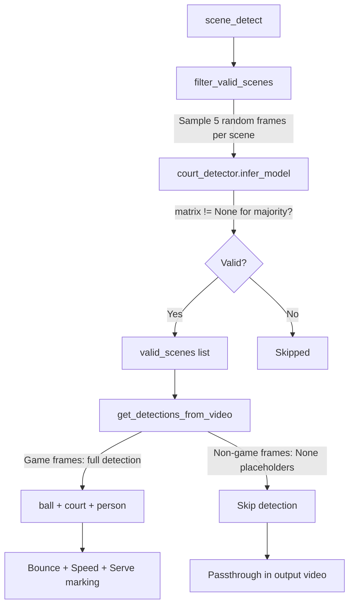

# Scene-Based Filtering and Serve Detection

## Context

Currently, `scene_detect()` in [`src/core/utils.py`](src/core/utils.py) returns scene boundaries (e.g., `[[0,250],[250,276],...]`) but is only used for thumbnail selection. The full video is processed frame-by-frame regardless of whether frames contain a tennis game.The court detector (`CourtDetectorNet.infer_model()` in [`src/core/court_detection_net.py`](src/core/court_detection_net.py)) returns `matrix_trans = None` when no court is detected -- this is the signal we use to classify scenes.

## Architecture




## Changes

### 1. New utility: `check_court_in_scene()` in [`src/core/utils.py`](src/core/utils.py)

Sample 5 random frames from a scene range, run court detection on each, return `True` if a court is detected in at least 2 of the 5 frames (to handle edge cases like transition frames).

```python
def check_court_in_scene(court_detector, video_path, start_frame, end_frame, num_samples=5):
    cap = cv2.VideoCapture(video_path)
    indices = sorted(random.sample(range(start_frame, end_frame), min(num_samples, end_frame - start_frame)))
    detections = 0
    for idx in indices:
        cap.set(cv2.CAP_PROP_POS_FRAMES, idx)
        ret, frame = cap.read()
        if not ret:
            continue
        matrices, _ = court_detector.infer_model([frame])
        if matrices[0] is not None:
            detections += 1
    cap.release()
    return detections >= 2
```


### 2. New function: `get_valid_scenes()` in [`src/core/process_video.py`](src/core/process_video.py)

Takes all scenes from `scene_detect()`, runs `check_court_in_scene()` on each, returns a list of valid scene ranges and a set of "scene start" frame indices for serve marking.

### 3. Modify `get_detections_from_video()` in [`src/core/process_video.py`](src/core/process_video.py)

- Accept a `valid_scenes` parameter (list of `[start, end]` ranges)
- Build a set of valid frame indices for O(1) lookup
- For frames NOT in valid scenes: append `None`/placeholder values to all result arrays (ball_track, homography_matrices, kps_court, player_top, player_bottom) without running any detectors
- For frames IN valid scenes: process normally through the existing batch pipeline
- This keeps the arrays the same length as total frames, preserving compatibility with video output

Key change in the frame loop:

```python
for i in range(total_frames):
    ret, frame = cap.read()
    if not ret:
        break
    if i not in valid_frame_set:
        # Append placeholders, no detection
        ball_track.append((None, None))
        homography_matrices.append(None)
        kps_court.append(None)
        player_top.append(None)
        player_bottom.append(None)
        continue
    frames.append(frame)
    # ... existing batch processing logic
```


### 4. Mark serves on bounces in `process_video()` in [`src/core/process_video.py`](src/core/process_video.py)

Serve is a property of a bounce, not of speed. After bounces are detected, iterate through them in order. For each valid scene, the first bounce that falls within it is the serve. Build a `serve_frames` set:

```python
serve_frames = set()
scene_starts = {s[0] for s in valid_scenes}
for bounce_index in sorted(bounces):
    for scene_start, scene_end in valid_scenes:
        if scene_start <= bounce_index < scene_end:
            if scene_start in scene_starts:
                serve_frames.add(bounce_index)
                scene_starts.discard(scene_start)
            break
```

No changes needed to `SpeedAt` -- it stays as-is.

### 5. Save `serve` in bounces data in [`src/db/utils.py`](src/db/utils.py)

Modify `save_bounces_in_db()` to accept a `serve_frames` set and store bounces as:

```json
{
  "56": { "position": [545.03, 1272.47], "serve": true },
  "69": { "position": [211.91, -208.13], "serve": false }
}
```

This is a breaking change to the bounces format -- the frontend/API consumers will need to handle the new structure.

### 6. Update video output loop in `process_video()`

For non-game frames, write them to the output video without any annotations (passthrough). The existing checks like `if ball_track[i][0] is not None `already handle this since skipped frames have `None` values, but we should also skip the minimap overlay and speed text for these frames.